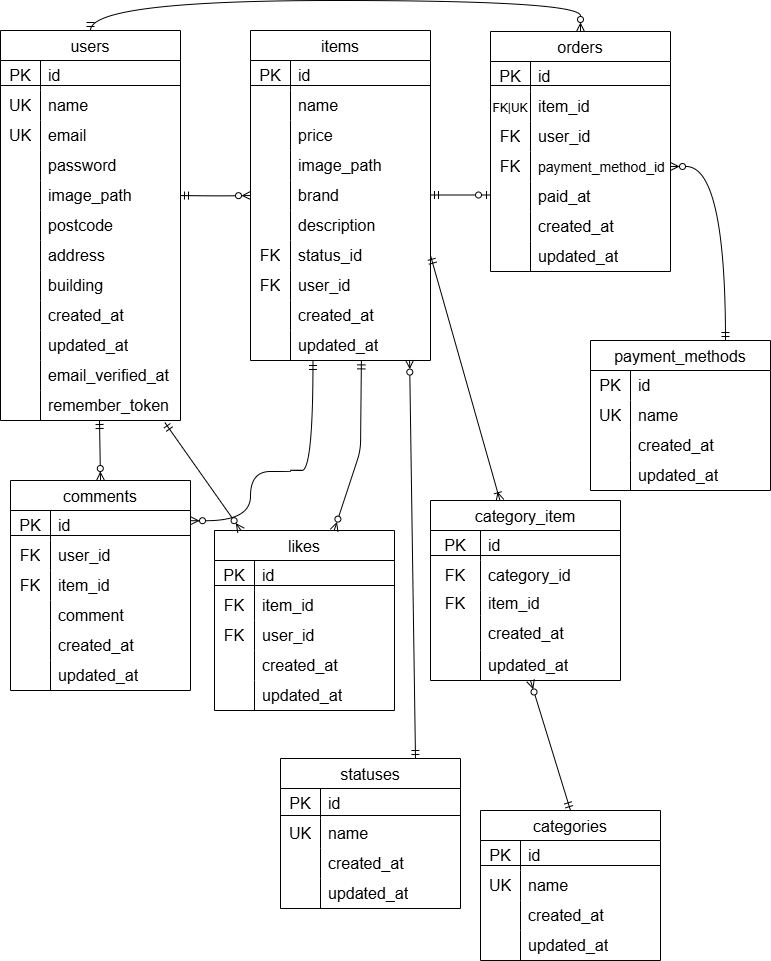

# フリマアプリ（Fleamarket-laravel）
Laravel + Docker を使用して構築した、簡易フリマアプリです。
ユーザーは商品を出品・購入でき、Stripeによる決済機能やメール認証も備えています。

## 実装機能

- ユーザー登録
  - ユーザー登録 / ログイン（メール認証あり）
  - マイページ（購入商品 / 出品商品をタブで切り替え表示）
  - マイリスト（いいねした商品一覧）

- 商品関連
  - 商品一覧ページ（おすすめ / マイリストのタブ切り替え）
  - 商品検索（キーワード検索）
  - 商品詳細ページ (いいね機能・コメント投稿機能)
  - 商品の出品

- 購入機能（Stripe決済）
  - カード支払い（テストカード対応）
  - コンビニ支払い(テスト)

- その他
  - シーディングによる初期データ登録
  - テストコードによる自動テスト
  - バリデーション機能

## 画面キャプチャ

### 商品一覧画面


### 商品詳細画面


### 商品購入画面


### 商品出品画面


### マイページ


## 環境構築

### Dockerビルド
1. `git clone https://github.com/imachanimachan/Fleamarket-laravel`
2. DockerDesktopアプリを立ち上げる
3. `docker-compose up -d --build`


### laravel環境構築

1. `docker-compose exec php bash`
2. `composer install`
3. .env.exampleファイルから.envを作成し、以下の環境変数を追加
```
cp .env.example .env
```

```
DB_CONNECTION=mysql
DB_HOST=mysql
DB_PORT=3306
DB_DATABASE=laravel_db
DB_USERNAME=laravel_user
DB_PASSWORD=laravel_pass
```

4. アプリケーションキーの作成
``` bash
php artisan key:generate
```

5. マイグレーションの実行
``` bash
php artisan migrate
```

6. シーディングの実行
``` bash
php artisan db:seed
```

7. シンボリックリンク作成
``` bash
php artisan storage:link
```

### Stripe 決済機能について

このアプリでは、Stripe を使用して「カード支払い」「コンビニ支払い」に対応しています。

※**模擬案件として Stripe のテストモードを使用し、決済フローを再現しています**

#### 導入手順

1. Stripe のアカウントを作成する
   https://dashboard.stripe.com/register

2. テスト用 API キーを取得する
   Stripe ダッシュボードから以下の情報を取得します
   - 公開可能キー（Publishable Key）: `pk_test_xxxxx`
   - シークレットキー（Secret Key）: `sk_test_xxxxx`

3. `.env` ファイルに以下の環境変数を追加してください
```
STRIPE_KEY=pk_test_あなたのキー
STRIPE_SECRET=sk_test_あなたのキー
```

4. Stripe PHP SDK をインストールします
```
composer require stripe/stripe-php
```

#### 決済テストに使えるダミーカード情報（Stripe公式）

- カード番号：`4242 4242 4242 4242`
- 有効期限：任意の値（例：12/34）
- CVC：任意の値（例：123）
- 郵便番号：任意の値（例：123-4567）


### メール認証機能について

このアプリでは、メール認証が完了しないとログインできない仕様になっています。
Mailhog を使用してメールの確認を行います。

#### Mailhog

Mailhog はこのプロジェクトに Docker コンテナとして組み込まれており、インストールする必要はありません。

#### 導入手順

1. `.env` ファイルに以下の環境変数を追加してください：
```
MAIL_MAILER=smtp
MAIL_HOST=mailhog
MAIL_PORT=1025
MAIL_USERNAME=null
MAIL_PASSWORD=null
MAIL_ENCRYPTION=null
```
2. Docker を起動

```
docker-compose up -d
```

3. Docker 起動後、以下のURLから Mailhog にアクセスできます
   http://localhost:8025

### テスト実行手順

1. テスト用データベースを作成

 MySQL コンテナにログインし、demo_test データベースを作成します。
```
docker exec -it <mysqlコンテナ名またはID> bash
mysql -u root -p
CREATE DATABASE demo_test;
```

2. .env.testing の設定

このリポジトリには .env.testing が含まれています。
以下のように設定されており、テスト時に demo_test を使用するようになっています
```
DB_CONNECTION=mysql
DB_DATABASE=demo_test
DB_USERNAME=root
DB_PASSWORD=root
```

3. テスト用のアプリケーションキーを生成（初回のみ）
```
php artisan key:generate --env=testing
```

4. テスト用データベースにマイグレーションを実行
```
php artisan migrate --env=testing
```

5. テストを実行
```
php artisan test
```

## 使用技術(実行環境)
- PHP8.3.0
- Laravel11.45.0
- MySQL8.0.26

## ER図


## テーブル設計


## URL
- 開発環境：http://localhost/
- phpMyAdmin：http://localhost:8080/
